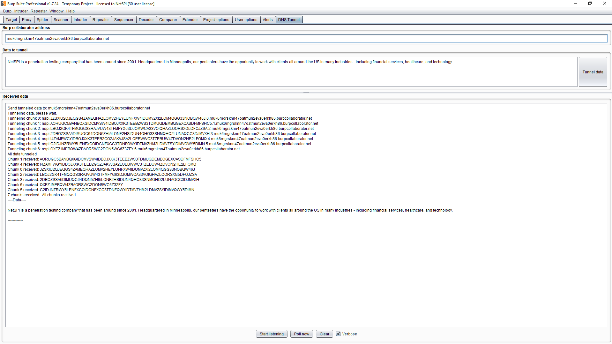

# BurpCollaboratorDNSTunnel
A DNS tunnel utilizing the Burp Collaborator.

This extension will create a DNS tunnel between two Burp Suite instances.  One instance will listen on its Burp Collaborator server, and the other will tunnel data through that DNS server.

An example is below (click to enlarge).  The example is using one Burp Suite instance, but the functionality works across two instances as well.

